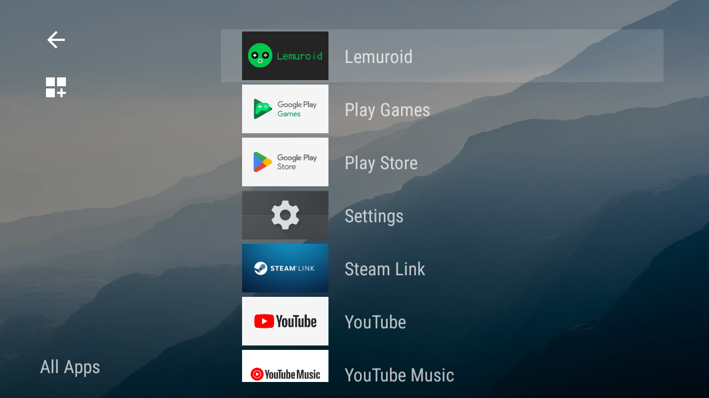

# Molla


Molla is an alternative launcher for Android, primarily designed for handheld gaming devices.

## Download

[](https://play.google.com/store/apps/details?id=com.sinu.molla)

or you can grab the APK from [here](https://github.com/sinusinu/Molla/releases/latest).

## Features

- D-pad first design - no touchscreen required
- A simple and intuitive Android TV-esque interface
- Packed with a bunch of ~~weird~~ niche features, including:
  - Separate wallpaper from system
  - Make Molla closeable
  - Autostart Molla at boot automatically
  - Launch an app at boot automatically
  - Custom shortcuts with "advanced options"
  - and more!

## Screenshots





Wallpaper is [Mountain dew during sunrise](https://unsplash.com/photos/mountain-dew-during-sunrise-xJ2tjuUHD9M) by Paul Earle.

## Building from Source

### Prerequisites
- JDK 11 or higher
- Android SDK (automatically downloaded by Gradle)

### Build Instructions

#### Using Gradle Wrapper (Recommended)
```bash
# Build debug APK
./gradlew assembleDebug

# Build release APK
./gradlew assembleRelease
```

The built APKs will be available in:
- `app/build/outputs/apk/debug/` - Debug APKs (signed, ready to install)
- `app/build/outputs/apk/release/` - Release APKs (unsigned)

**Note:** For local testing and development, use **debug APKs** which are automatically signed and can be installed via ADB:
```bash
adb install app/build/outputs/apk/debug/app-armeabi-v7a-debug.apk
```

Release APKs are unsigned by default. To install a release APK, either:
1. Uninstall any existing version of the app first, then sign the APK manually
2. Configure a custom signing key in `app/build.gradle` for release builds

#### Multi-ABI Support
The project is configured to build separate APKs for different CPU architectures:
- **armeabi-v7a** - 32-bit ARM devices
- **arm64-v8a** - 64-bit ARM devices
- **universal** - APK that works on all architectures

### GitHub Actions
The project includes automated builds via GitHub Actions. On every push or pull request to the main branch, the workflow automatically builds both debug and release APKs for all supported architectures. Built APKs are available as artifacts in the Actions tab.

## License

Molla is distributed under the GNU GPL v3.
